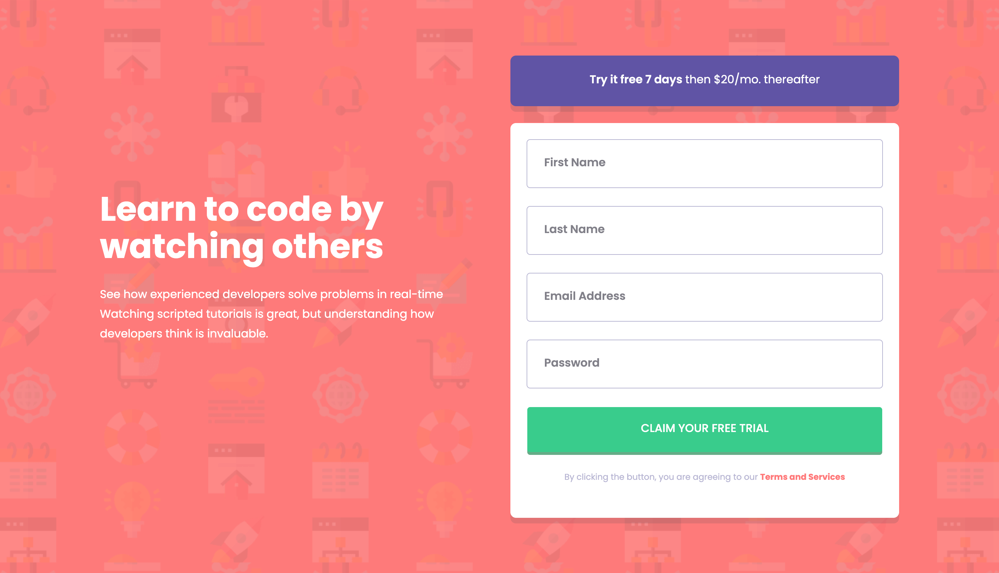
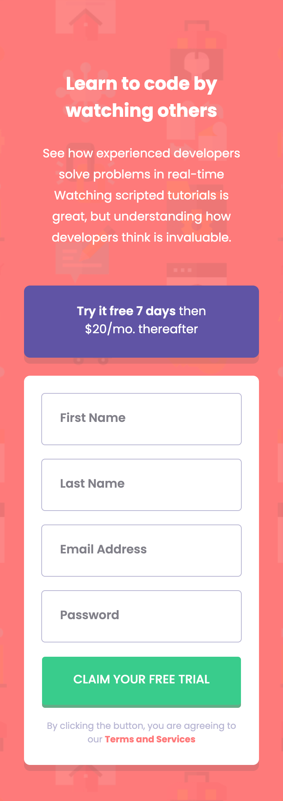

# Frontend Mentor - Intro component with sign up form solution

This is a solution to the [Intro component with sign up form challenge on Frontend Mentor](https://www.frontendmentor.io/challenges/intro-component-with-signup-form-5cf91bd49edda32581d28fd1). Frontend Mentor challenges help you improve your coding skills by building realistic projects.

## Table of contents

- [Overview](#overview)
  - [The challenge](#the-challenge)
  - [Screenshot](#screenshot)
  - [Links](#links)
- [My process](#my-process)
  - [Built with](#built-with)
  - [What I learned](#what-i-learned)
  - [Continued development](#continued-development)
  - [Useful resources](#useful-resources)
- [Author](#author)
- [Acknowledgments](#acknowledgments)

**Note: Delete this note and update the table of contents based on what sections you keep.**

## Overview

### The challenge

Users should be able to:

- View the optimal layout for the site depending on their device's screen size
- See hover states for all interactive elements on the page
- Receive an error message when the `form` is submitted if:
  - Any `input` field is empty. The message for this error should say _"[Field Name] cannot be empty"_
  - The email address is not formatted correctly (i.e. a correct email address should have this structure: `name@host.tld`). The message for this error should say _"Looks like this is not an email"_
- Once users complete each `input` field, they can see the successful outline

### Screenshot

### Links

- [Solution URL](https://github.com/Beginneraboutlife116/fem-intro-component-with-signup-form)
- [Live Site URL](https://fem-intro-component-with-signup-form-dbe75dcee.vercel.app/login)

## My process

### Built with

- Semantic HTML5 markup
- SCSS
- CUBE CSS
- Mobile-first workflow
- [React](https://reactjs.org/) - JS library
- [Next.js](https://nextjs.org/) - React framework

### What I learned

I tried to build input components.
The most confuse point for me in this challenge was how I get the form data. Should I get that from `useState` or from `useRef`, which is via DOM. At the end, I got the form data from `useState`. I thought that it obeys the controlled components concept from React.

### Continued development

I would like to write a notification component which could help user know whether their submit is well or not. The prototype may refer to Sweetalert library.

### Useful resources

- [ReactJS](https://react.dev/) - This helps me learn how to write React.
- [NextJS](https://nextjs.org/) - This helps me learn how to use NextJs framework.

## Author

- Website - [Kai Lin](https://github.com/Beginneraboutlife116)
- Frontend Mentor - [@yourusername](https://www.frontendmentor.io/profile/yourusername)
- Twitter - [@yourusername](https://www.twitter.com/yourusername)
